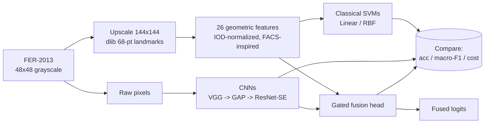
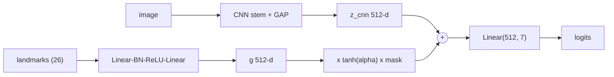

# Emotion Recognition from Facial Landmarks — FER-2013

The main runnable scripts are [`SVM_notebook.ipynb`](https://github.com/werka-z/emotion-recognition/edit/main/README.md#:~:text=SVM_notebook.ipynb) and [`CNN_notebook.ipynb`](https://github.com/werka-z/emotion-recognition/edit/main/README.md#:~:text=CNN_notebook.ipynb) for SVM and CNN experiments respectively. Alongside the notebooks, see `PIPELINE.md` and `CNN/README.md` for instructions. 


Course project for *Applied Machine Learning in Python* (LMU München).
Doğa Devrim Çelik & Weronika Zygis.

We classify the seven FER-2013 emotions (angry, disgust, fear, happy, neutral, sad, surprise) three ways and compare them: **classical SVMs on handcrafted geometric
landmark features → CNNs on raw pixels → a fused model that merges the two.**

Geometry gives a cheap, interpretable model but caps out well
below the CNN; a well-regularized CNN reaches the noisy human ceiling (~0.67 macro-F1);
and merging landmarks into the CNN does **not** help — the gate the model learns to
admit landmark signal barely opens, because the CNN already encodes that structure
from pixels. That negative result is one of the project's main findings.

## Pipeline



## Fusion architecture

The fusion head takes the CNN's penultimate 512-d embedding and adds a **gated**
contribution from the landmark features. A single learnable scalar `alpha` starts at 0
(so the model begins as a pure CNN), and a per-sample `mask` zeroes the landmark branch
whenever dlib found no face — graceful degradation, no imputation.



`z_fused = z_cnn + tanh(alpha) * mask * g(landmarks)`

Additive gating (rather than concatenation) is deliberate: it gives one interpretable
knob — the optimizer grows `alpha` only if geometry genuinely helps, so its final value
is a clean measure of how much the model relied on landmarks. Same idea as LayerScale /
Flamingo gating, applied to modality fusion.

## Results

All metrics on the held-out test set (7,178 images). Macro-F1 is the primary metric
because of FER-2013's severe class imbalance (disgust ≈ 1.5%, happy ≈ 25%).

| Model | Accuracy | Macro-F1 | Weighted-F1 |
|---|---|---|---|
| Linear SVM (landmarks) | 0.482 | 0.371 | 0.451 |
| RBF SVM (landmarks) | 0.560 | 0.520 | 0.555 |
| Baseline VGG CNN | 0.665 | 0.647 | 0.663 |
| GAP + Aug + LS CNN (TTA) | 0.696 | 0.661 | 0.696 |
| **ResNet-SE + MixUp + EMA CNN (TTA)** | **0.697** | **0.670** | 0.695 |
| CNN + concat fusion | 0.702 | 0.682 | 0.701 |
| CNN + gated fusion (α init 0) | 0.680 | 0.638 | 0.682 |

### CNN progression

Each CNN targets the previous one's failure mode:

| Model | Key changes | Why |
|---|---|---|
| Baseline VGG | 3 conv blocks + big FC head | Standard FER baseline; overfits (train 0.74 / val 0.66) |
| GAP + Aug + LS | Global Average Pooling head, +1 block, stronger aug, label smoothing, cosine LR | Removes the ~2.4M-param FC (main overfit source) |
| ResNet-SE + MixUp + EMA | Residual blocks + Squeeze-Excitation, MixUp/CutMix, EMA, 100 epochs | Depth + attention + strongest regularizer; ~11M params |

- Validation-accuracy curves: [`figures/cnn_val_acc_progression.png`](figures/cnn_val_acc_progression.png)
- Confusion matrices: baseline [`figures/cnn_baseline_cm.png`](figures/cnn_baseline_cm.png), best [`figures/cnn_best_cm.png`](figures/cnn_best_cm.png)

`happy` and `surprise` are the strongest classes throughout (F1 ≈ 0.87 / 0.80) — the most
visually distinct expressions. `fear` is always the weakest (F1 ≈ 0.47–0.52), confused mainly
with `sad`, `angry` and `neutral`. The refinements mostly buy robustness on that middle cluster
and recover `disgust` recall.

### Fusion ablation

Four variants, all fine-tuned from the GAP backbone, 40 epochs, no TTA:

| Variant | Accuracy | Macro-F1 | α_final |
|---|---|---|---|
| CNN only (reference) | 0.696 | 0.661 | — |
| CNN + concat | 0.702 | 0.682 | — |
| CNN + gated (α init 0) | 0.680 | 0.638 | 0.039 |
| CNN + gated (α frozen = 1) | 0.690 | 0.649 | 1.0 (frozen) |

**The gate barely opens** (α_final = 0.039, peak 0.055) and flatlines — see
[`figures/fusion_alpha.png`](figures/fusion_alpha.png). The learned gated model does not beat
CNN-only; forcing the gate fully open recovers some ground but still doesn't exceed the baseline;
only naive concat edges ahead, most plausibly from extra head capacity rather than new geometric
information (and it has no graceful path for the ~14% of images with no detected face).
Conclusion: at 48×48 resolution and ~80% detection rate, handcrafted geometry adds no reliable
signal on top of a well-regularized CNN.

## Computational cost

The two pipelines live in different regimes: the SVM side is CPU-bound and
dominated by one-time dlib feature extraction (the fit itself is trivial),
while the CNN side is GPU/MPS-bound and dominated by gradient descent.

| Approach | Total training cost | Notes |
|---|---|---|
| Classical SVM | ~10¹²–10¹³ FLOPs, CPU only | Dominated by the dlib pass over all 35,887 images (upscaled to 144×144, ~79% detection) — tens of CPU-minutes. The SVM fit is cheap: linear in seconds; the from-scratch cvxopt RBF is ~O(N²) in the kernel matrix → grid search ran on a 6k subsample, whereas sklearn's libsvm SMO fits the full 22.5k set in **6.9 s**. Fully interpretable. |
| CNNs | ~10¹⁶ FLOPs, GPU/MPS | Baseline 2.13×10¹⁵ FLOPs (3.51M params, 40 ep, Apple MPS) → GAP 2.91×10¹⁵ → ResNet-SE 1.16×10¹⁶ (11.26M params, 60 ep, Colab T4, ~3.7h). ~10³× the classical FLOPs for ~+14 acc points. |
| Fusion | ~backbone + full dlib pass | Landmark head is negligible (~GAP backbone per run), but each variant still needs the full dlib extraction at train and test — inherits the classical cost for no reliable gain. |

CNN training FLOPs are measured with PyTorch's FLOP counter (`CNN/baseline_CNN/compute_flops.py`),
taking training cost ≈ 3× forward FLOPs (fwd + ~2× bwd) × samples seen. The full
side-by-side breakdown (per-model FLOPs, solver scaling, ablation scope) is in
[`report.tex`](report.tex) (Methods → CNN Models and the Discussion).

## Repository layout

```
paths.py              repo-root-anchored path resolution — every script imports from here
ablation_studies/     SVM-side ablations: upscaling, CLAHE, feature selection, RBF grid search
ablation_results/     ablation outputs, one subfolder per study
extract_features.py   final single-condition dlib landmark + 26-feature extraction
features/             output of extract_features.py — X/y/paths + scaler .npy (shared by SVMs)
models/svm/           final SVM scripts (courselib cvxopt + sklearn reference)
model_results/svm/    final SVM outputs
CNN/
  visualize.py              shared, model-agnostic plotting helpers
  baseline_CNN/            VGG-style baseline
  cnn_gap_aug_labelsmooth/ GAP + augmentation + label smoothing (fusion backbone)
  cnn_resnet_se_mixup_ema/ ResNet-SE + MixUp + EMA (best CNN)
  fusion_gated/            gated landmark–CNN fusion + 4-way ablation
figures/              plots used in report.tex
report.tex            full write-up
SVM_notebook.ipynb    runs the full classical/SVM pipeline end to end
CNN_notebook.ipynb    runs all four CNN models end to end
```

`PIPELINE.md` documents the SVM-side scripts and their run order in detail.

## Running

Each pipeline has a notebook that runs it end to end: `SVM_notebook.ipynb`
for the classical pipeline, `CNN_notebook.ipynb` for all four CNN models.

Two conda environments cover everything:

```bash
conda env create -f environment.yml            # fer_feature_extraction — dlib feature extraction
conda env create -f environment_appliedml.yml  # appliedml — SVMs + CNNs (sklearn, cvxopt, torch)
```

Only the dlib feature-extraction step needs `fer_feature_extraction`; the SVM
and CNN notebooks both run under `appliedml`. `SVM_notebook.ipynb` tells you
when to switch kernels; the SVM side also needs the courselib `AppliedML` repo
(see `PIPELINE.md`).

To run the CNN scripts manually instead of via the notebook (from repo root,
`appliedml` env):

```bash
python -m CNN.baseline_CNN.train           && python -m CNN.baseline_CNN.test
python -m CNN.cnn_gap_aug_labelsmooth.train && python -m CNN.cnn_gap_aug_labelsmooth.test --tta
python -m CNN.cnn_resnet_se_mixup_ema.train && python -m CNN.cnn_resnet_se_mixup_ema.test --tta-multi

# fusion + ablation
python -m CNN.fusion_gated.build_alignment          # one-time landmark extraction cache
python -m CNN.fusion_gated.train --finetune         # gated (default)
python -m CNN.fusion_gated.train --finetune --ablation concat
python -m CNN.fusion_gated.train --finetune --ablation frozen
python -m CNN.fusion_gated.test
```

## Dataset

[FER-2013](https://www.kaggle.com/datasets/msambare/fer2013/data): 48×48 grayscale faces,
7 emotions, ~28.7k train / 7.2k test. Heavily imbalanced, noisy labels (human agreement
~65–70%), which sets a low practical accuracy ceiling.
</content>
</invoke>
